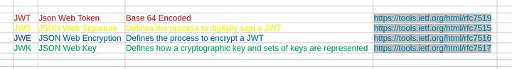
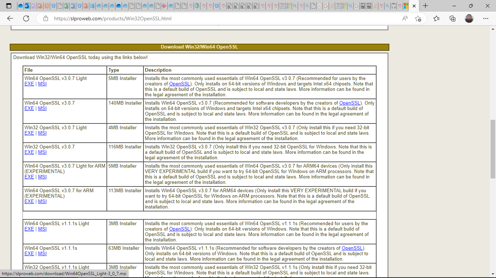
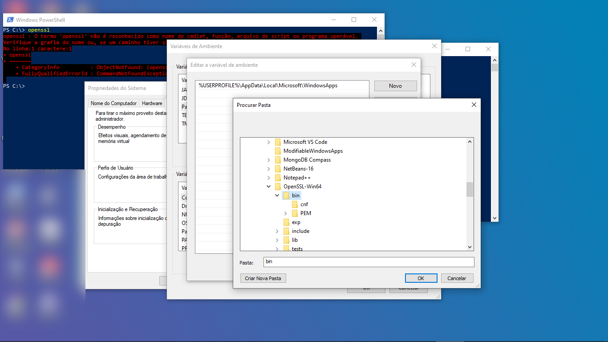
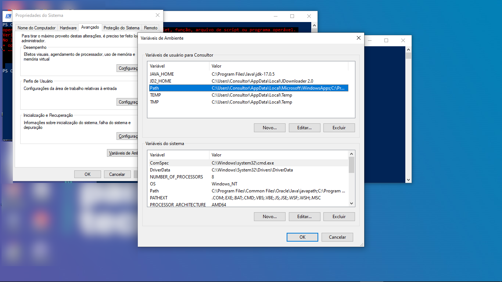
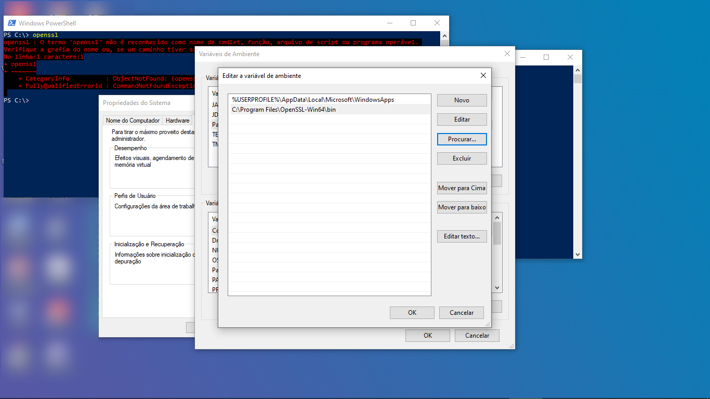
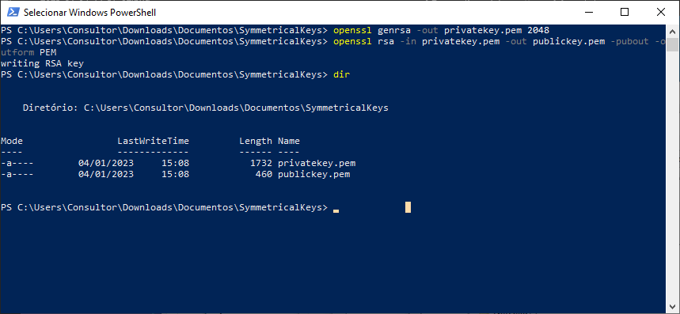
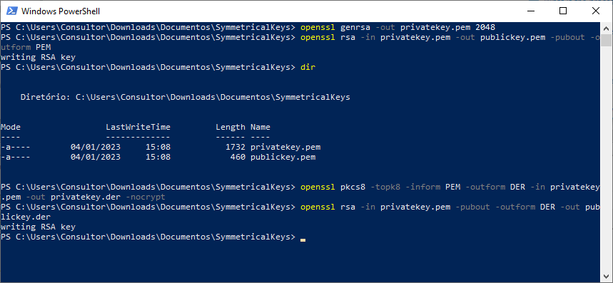

# DemosJWT

Different token generation codes (JWT), java 17 various libraries, JWS, JWE, JWK



| Acronym | Name | Description | RFC |
| ------ | ------ | ------ | ------ |
| JWT | JSON Web Token| Base 64 Encoded | https://datatracker.ietf.org/doc/html/rfc7519 |
| JWS | JSON Web Signature | Defines the process to digitally sign a JWT | https://datatracker.ietf.org/doc/html/rfc7515 |
| JWE | JSON Web Encryption | Defines the process to encrypt a JWT | https://datatracker.ietf.org/doc/html/rfc7516 |
| JWK | JSON Web Key | Defines how a cryptographic key and sets of keys are represented | https://datatracker.ietf.org/doc/html/rfc7517 |
| JWA | JSON Web Algorithms | Defines a cryptographic algorithms be used with JWS | https://datatracker.ietf.org/doc/html/rfc7518 |

## JSON Web Token (JWT)
JSON Web Token (JWT) is a compact, URL-safe means of representing claims to be transferred between two parties.  The claims in a JWT are encoded as a JSON object that is used as the payload of a JSON Web Signature (JWS) structure or as the plaintext of a JSON Web Encryption (JWE) structure, enabling the claims to be digitally signed or integrity protected with a Message Authentication Code (MAC) and/or encrypted.


## JSON Web Signature (JWS)
JSON Web Signature (JWS) represents content secured with digital signatures or Message Authentication Codes (MACs) using JSON-based data structures.  Cryptographic algorithms and identifiers for use with this specification are described in the separate JSON Web Algorithms (JWA) specification and an IANA registry defined by that specification.  Related encryption capabilities are described in the separate JSON Web Encryption (JWE) specification.


## JSON Web Encryption (JWE)
JSON Web Encryption (JWE) represents encrypted content using JSON-based data structures. Cryptographic algorithms and identifiers for use with this specification are described in the separate JSON Web Algorithms (JWA) specification and IANA registries defined by that specification. Related digital signature and Message Authentication Code (MAC) capabilities are described in the separate JSON Web Signature (JWS) specification.


## JSON Web Key (JWK)
A JSON Web Key (JWK) is a JavaScript Object Notation (JSON) data structure that represents a cryptographic key. This specification also defines a JWK Set JSON data structure that represents a set of JWKs. Cryptographic algorithms and identifiers for use with this specification are described in the separate JSON Web Algorithms (JWA) specification and IANA registries established by that specification.


## JSON Web Algorithms (JWA)
This specification registers cryptographic algorithms and identifiers to be used with the JSON Web Signature (JWS), JSON Web Encryption (JWE), and JSON Web Key (JWK) specifications.  It defines several IANA registries for these identifiers.


## JWT Specification
A JSON Web Token consists of three parts:


- Header
- Payload
- Signature

The header and payload are Base64 encoded and concatenated by a period. The end result is algorithmically signed, producing a token in the form of “header.claims.signature”.

**Header**:

| Name | Sample Value | Required | 	Comments |
| ------ | ------ | ------ | ------ |
| alg | RS256 | Yes | Algorithm to use |
| cty | JWS | Yes | Content type should be JWS |
| typ | JWT | Yes| Type should be JWT |
| kid | xxxxxxxxxxxxxxxxxxxxxxxxxxxxxxxxxxxxxxxxxxxxxxxxxxxxxxxxxxxxxxxxxxxxxxxxxxxxxx | Yes | Consumer Key obtained while onboarding the project |

Example:

Header
{

  "alg": "RS256",

  "cty": "JWS",

  "typ": "JWT",

  "kid": "xxxxxxxxxxxxxxxxxxxxxxxxxxxxxxxxxxxxxxxxxxxxxxxxxxxxxxxxxxxxxxxxxxxxxxxxxxxxxx"

}

**Payload**

| Name | Sample Value | Required | Comments|
| ------ | ------ | ------ | ------ |
| sub | not_available | Yes | The Subject should always be “not_available” |
| alias | John_Name | Yes | The alias should be a unique identifier per user formed by concatenating user identifier and client Identifier |
| nbf | 1629312476 | Yes | Not before date |
| exp | 1629402476 | Yes | Expiry date |
| iat | 1629312476 | Yes | Issued at date |
| jti | e8ff3bfeb1ebd0 | Yes | Unique JWT ID |
| tid | MIDS | Yes | Should always be “MIDS” |

Example:

Payload

{
"sub": "not_available",

"alias": "John_Name",

"nbf": 1629312476,

"exp": 1629402476,

"iat": 1629312476,

"jti": "e8ff3bfeb1ebd0",

"tid": "MIDS"

}

## Installation of OpenSSL and creation of Public and Private key

In windows install Win64OpenSSL-3_0_7.msi -> [https://slproweb.com/products/Win32OpenSSL.html](https://slproweb.com/products/Win32OpenSSL.html)



Add C:\Program Files\OpenSSL-Win64\bin\ in Windows environment variables







## Algoritmo = RSA

Private key size has the following four options.

- 512 bit low resistance key

- 1024 bit medium strength key

- 2048 bit high strength key

- 4096 bit very high resistance key

## In powershell

- private key -> openssl genrsa -out privatekey.pem 2048

- public key -> openssl rsa -in privatekey.pem -out publickey.pem -pubout -outform PEM



## For JAVA

- Convert private key to PKCS#8 format

openssl pkcs8 -topk8 -inform PEM -outform DER -in privatekey.pem -out privatekey.der -nocrypt

- Convert public key to DER format

openssl rsa -in privatekey.pem -pubout -outform DER -out publickey.der



## Code for private key

import java.nio.file.*;

import java.security.*;

import java.security.spec.*;

public class PrivateKeyReader {

  public static PrivateKey get(String filename) throws Exception {

      byte[] keyBytes = Files.readAllBytes(Paths.get(filename));

      PKCS8EncodedKeySpec spec = new PKCS8EncodedKeySpec(keyBytes);

      KeyFactory kf = KeyFactory.getInstance("RSA");

      return kf.generatePrivate(spec);
  
  }

}

## Code for public key

import java.nio.file.*;

import java.security.*;

import java.security.spec.*;

public class PublicKeyReader {

  public static PublicKey get(String filename) throws Exception {
    
      byte[] keyBytes = Files.readAllBytes(Paths.get(filename));

      X509EncodedKeySpec spec = new X509EncodedKeySpec(keyBytes);

      KeyFactory kf = KeyFactory.getInstance("RSA");

      return kf.generatePublic(spec);

  }
  
}


## Getting started

To make it easy for you to get started with GitLab, here's a list of recommended next steps.

Already a pro? Just edit this README.md and make it your own. Want to make it easy? [Use the template at the bottom](#editing-this-readme)!

## Add your files

- [ ] [Create](https://docs.gitlab.com/ee/user/project/repository/web_editor.html#create-a-file) or [upload](https://docs.gitlab.com/ee/user/project/repository/web_editor.html#upload-a-file) files
- [ ] [Add files using the command line](https://docs.gitlab.com/ee/gitlab-basics/add-file.html#add-a-file-using-the-command-line) or push an existing Git repository with the following command:

```
cd existing_repo
git remote add origin https://git.ujacraft.es/jlrodrol/demosjwt.git
git branch -M main
git push -uf origin main
```
